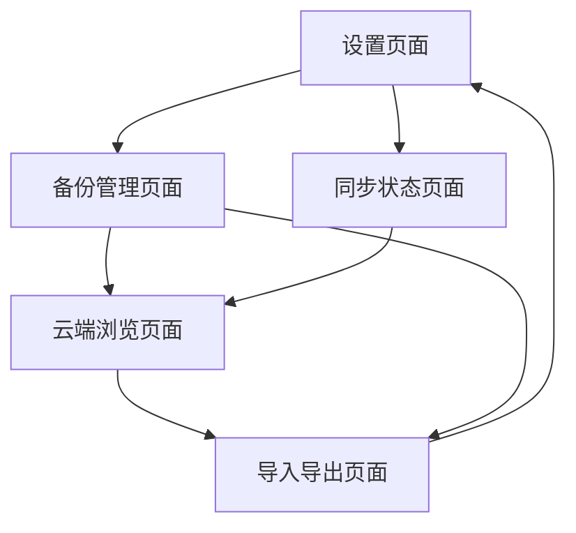

# Obsidian ZimaOS 同步插件产品需求文档

## 1. 产品概述

本插件旨在为Obsidian用户提供与ZimaOS系统的无缝数据同步功能，实现笔记的自动备份、导出和云端访问。通过集成ZimaOS的文件管理API，用户可以安全地将Obsidian笔记备份到私有云存储，并支持从ZimaOS访问和导入历史备份数据。该插件解决了Obsidian用户数据安全和跨设备同步的核心需求，为个人知识管理提供可靠的数据保障。

## 2. 核心功能

### 2.1 用户角色

| 角色 | 注册方式 | 核心权限 |
|------|----------|----------|
| 默认用户 | 无需注册，直接使用 | 可以配置ZimaOS连接、备份和同步笔记、访问云端数据 |

### 2.2 功能模块

我们的Obsidian ZimaOS同步插件需求包含以下主要页面：

1. **设置页面**：ZimaOS连接配置、同步设置、备份策略配置
2. **备份管理页面**：手动备份触发、备份历史查看、恢复操作
3. **云端浏览页面**：ZimaOS文件浏览、图片选择、笔记导入
4. **同步状态页面**：实时同步状态、错误日志、网络连接状态
5. **导入导出页面**：批量导出笔记、选择性导入、格式转换

### 2.3 页面详情

| 页面名称 | 模块名称 | 功能描述 |
|----------|----------|----------|
| 设置页面 | ZimaOS连接配置 | 配置ZimaOS服务器地址、端口、认证信息，测试连接状态 |
| 设置页面 | 同步设置 | 设置自动同步间隔、同步范围、排除文件类型 |
| 设置页面 | 备份策略 | 配置备份频率、保留策略、压缩选项 |
| 备份管理页面 | 手动备份 | 立即触发完整备份或增量备份，显示备份进度 |
| 备份管理页面 | 备份历史 | 查看历史备份记录、备份大小、创建时间 |
| 备份管理页面 | 恢复操作 | 从指定备份点恢复笔记，支持选择性恢复 |
| 云端浏览页面 | 文件浏览器 | 浏览ZimaOS上的文件夹结构，支持搜索和筛选 |
| 云端浏览页面 | 图片选择器 | 从ZimaOS选择图片插入到笔记中，支持预览 |
| 云端浏览页面 | 笔记导入 | 从ZimaOS导入之前备份的笔记文件 |
| 同步状态页面 | 状态监控 | 显示当前同步状态、最后同步时间、待同步文件数 |
| 同步状态页面 | 错误日志 | 记录和显示同步过程中的错误信息 |
| 同步状态页面 | 网络状态 | 监控与ZimaOS的网络连接状态 |
| 导入导出页面 | 批量导出 | 选择笔记范围进行批量导出到ZimaOS |
| 导入导出页面 | 选择性导入 | 从ZimaOS选择特定笔记进行导入 |
| 导入导出页面 | 格式转换 | 支持多种格式的导入导出（Markdown、PDF、HTML） |

## 3. 核心流程

**主要用户操作流程：**

1. **初始设置流程**：用户首次使用时配置ZimaOS连接信息 → 测试连接 → 设置同步策略 → 完成初始化

2. **日常同步流程**：自动检测笔记变更 → 增量同步到ZimaOS → 更新同步状态 → 记录操作日志

3. **备份恢复流程**：选择备份策略 → 执行备份操作 → 验证备份完整性 → 需要时从备份恢复

4. **云端访问流程**：浏览ZimaOS文件 → 选择所需资源 → 导入到Obsidian → 更新本地库

## 4. 用户界面设计

### 4.1 设计风格

- **主色调**：深蓝色 (#2563eb) 和浅灰色 (#f8fafc)
- **辅助色**：绿色 (#10b981) 表示成功，红色 (#ef4444) 表示错误，橙色 (#f59e0b) 表示警告
- **按钮样式**：圆角按钮，3px圆角，带有轻微阴影效果
- **字体**：系统默认字体，标题使用16px，正文使用14px，小字使用12px
- **布局风格**：卡片式布局，顶部导航，左侧边栏用于功能切换
- **图标风格**：使用Lucide图标库，简洁线性风格

### 4.2 页面设计概览

| 页面名称 | 模块名称 | UI元素 |
|----------|----------|--------|
| 设置页面 | ZimaOS连接配置 | 输入框（服务器地址、端口）、密码框、测试连接按钮（蓝色）、状态指示器 |
| 设置页面 | 同步设置 | 滑动开关、下拉选择框、数字输入框、复选框组 |
| 备份管理页面 | 手动备份 | 大型操作按钮、进度条、状态文本、时间戳显示 |
| 备份管理页面 | 备份历史 | 表格视图、排序按钮、搜索框、操作按钮组 |
| 云端浏览页面 | 文件浏览器 | 树形结构、面包屑导航、搜索框、文件图标、右键菜单 |
| 云端浏览页面 | 图片选择器 | 网格布局、图片预览、选择复选框、确认按钮 |
| 同步状态页面 | 状态监控 | 状态卡片、彩色指示器、刷新按钮、详情展开 |
| 导入导出页面 | 批量导出 | 文件选择器、格式选择下拉框、导出按钮、进度显示 |

### 4.3 响应式设计

插件采用桌面优先设计，针对Obsidian的桌面应用进行优化。界面支持窗口大小调整，在较小窗口下采用垂直布局，确保所有功能在不同屏幕尺寸下都能正常使用。不考虑触摸交互优化，专注于鼠标和键盘操作体验。