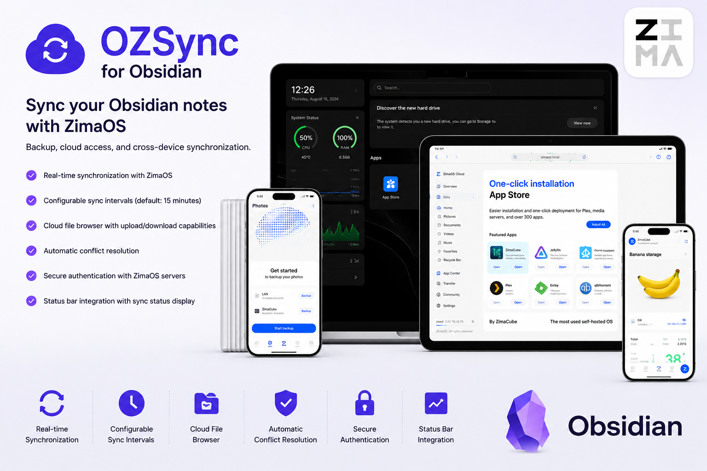

# OZSync for Obsidian

Sync your Obsidian notes with ZimaOS for backup, cloud access, and cross-device synchronization.



This plugin provides seamless integration between Obsidian and ZimaOS, allowing you to:
- Automatically sync your notes to ZimaOS cloud storage
- Access your notes from multiple devices
- Keep your notes backed up and secure
- Browse and manage your cloud files directly from Obsidian

Key features:
- Real-time synchronization with ZimaOS
- Configurable sync intervals (default: 15 minutes)
- Cloud file browser with upload/download capabilities
- Automatic conflict resolution
- Secure authentication with ZimaOS servers
- Status bar integration with sync status display

## Installation

### Method 1: Manual Installation (Recommended)

**Step 1: Download the source code**
```bash
git clone https://github.com/LinkLeong/OZSync.git
cd OZSync
```

**Step 2: Install dependencies and build**
```bash
npm install
npm run build
```

**Step 3: Copy to Obsidian plugins directory**

1. Find your vault folder (the folder containing your Obsidian notes)
2. Navigate to `YourVaultFolder/.obsidian/plugins/`
3. Create a new folder named `ozsync`
4. Copy the following files from the built project to `YourVaultFolder/.obsidian/plugins/ozsync/`:
   - `main.js`
   - `manifest.json`
   - `styles.css`

**Step 4: Enable the plugin in Obsidian**

1. Open Obsidian
2. Go to Settings (⚙️ icon)
3. Navigate to "Community plugins"
4. If "Restricted mode" is enabled, turn it off
5. Click "Refresh" to detect the new plugin
6. Find "OZSync" in the list of installed plugins
7. Toggle the switch to enable it

### Method 2: Development Installation

For developers who want to modify the plugin:

**Step 1: Clone directly to plugins directory**
```bash
cd /path/to/your/vault/.obsidian/plugins/
git clone https://github.com/LinkLeong/OZSync.git ozsync
cd ozsync
```

**Step 2: Install dependencies and start development**
```bash
npm install
npm run dev
```

**Step 3: Enable in Obsidian**
- Follow Step 4 from Method 1
- The plugin will automatically rebuild when you make changes

## Configuration

### Initial Setup

1. After enabling the plugin, click the OZSync icon in the left sidebar or use the command palette (Ctrl/Cmd + P) and search for "OZSync"
2. In the settings panel, configure:
   - **ZimaOS Server URL**: Enter your ZimaOS server address (e.g., `http://192.168.1.100:8080`)
   - **Username**: Your ZimaOS username
   - **Password**: Your ZimaOS password
   - **Sync Directory**: Choose which folder to sync (default: root vault folder)

### Sync Settings

- **Auto Sync**: Enable automatic synchronization (enabled by default)
- **Sync Interval**: Set how often to sync (default: 15 minutes)
- **Conflict Resolution**: Choose how to handle file conflicts:
  - **Ask**: Prompt for each conflict
  - **Local**: Always keep local version
  - **Remote**: Always keep remote version
  - **Newer**: Keep the newer file based on modification time

## Usage

### Basic Operations

**Manual Sync**
- Click the sync button in the status bar (bottom right)
- Use Command Palette: "OZSync: Sync Now"
- Use the ribbon icon in the left sidebar

**View Sync Status**
- Check the status bar for current sync status
- Green: Synced successfully
- Yellow: Syncing in progress
- Red: Sync error

**Browse Cloud Files**
- Click the OZSync icon in the left sidebar
- Browse, upload, and download files directly
- Right-click for context menu options

### Advanced Features

**Debug Mode**
- Enable in settings to see detailed sync logs
- Use Command Palette: "OZSync: Debug Status Bar" for troubleshooting
- Check browser console for detailed debug information

**Status Bar Information**
- Shows last sync time
- Displays sync status
- Click to open sync panel

## Troubleshooting

### Common Issues

**Plugin not appearing in Obsidian**
- Ensure all files (`main.js`, `manifest.json`, `styles.css`) are in the correct directory
- Check that "Restricted mode" is disabled in Community plugins settings
- Try refreshing the plugin list

**Sync not working**
- Verify ZimaOS server URL is correct and accessible
- Check username and password
- Ensure ZimaOS server is running and reachable
- Check debug logs for specific error messages

**Files not syncing**
- Check if files are in the configured sync directory
- Verify file permissions
- Look for conflict resolution prompts

### Debug Information

To get debug information:
1. Enable debug mode in plugin settings
2. Open browser developer tools (F12)
3. Check the Console tab for detailed logs
4. Use "OZSync: Debug Status Bar" command for status information

## Development

### Building from Source

```bash
# Clone the repository
git clone https://github.com/LinkLeong/OZSync.git
cd OZSync

# Install dependencies
npm install

# Build for production
npm run build

# Development mode (auto-rebuild)
npm run dev
```

### Project Structure

- `src/main.ts` - Main plugin entry point
- `src/ozsync-client.ts` - ZimaOS API client
- `src/settings.ts` - Plugin settings interface
- `src/file-browser.ts` - Cloud file browser component
- `manifest.json` - Plugin metadata
- `styles.css` - Plugin styles

## Support

If you encounter any issues or have questions:

1. Check the troubleshooting section above
2. Enable debug mode and check console logs
3. Create an issue on [GitHub](https://github.com/LinkLeong/OZSync/issues)
4. Include debug logs and system information when reporting issues

## Sponsor

If you find OZSync helpful, please consider supporting the development:

[](https://ko-fi.com/linkliang)

Your support helps maintain and improve this plugin. Thank you!

## License

This project is licensed under the MIT License - see the LICENSE file for details.
